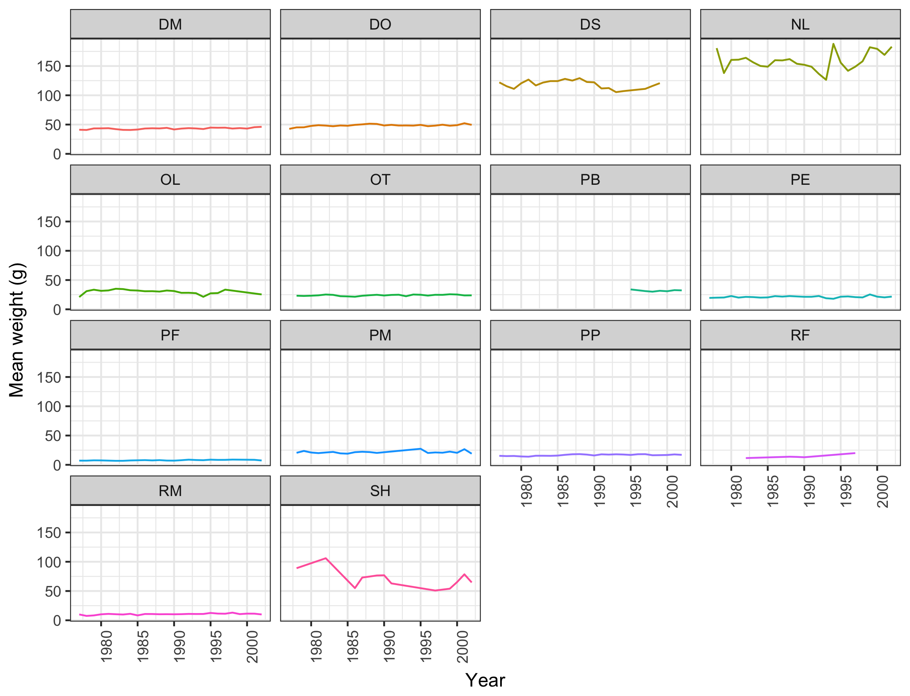

# 2017-ucmerced-datacarpentry
My repository for UCM data carpentry workshop

ggsave("my_plot.png", my_plot, width = 15, height = 10) #saving plot to computer

PASTE THIS IN YOUR README

# my-project

Playing with [Data Carpentry at UC Merced -  Yosemite](https://snacktavish.github.io/2017-08-17-Yosemite/).

## Introduction

This repository demonstrates **software** and _formats_:

1. **Git**
1. **Github**
1. _Markdown_
1. _Rmarkdown_

## Conclusion

